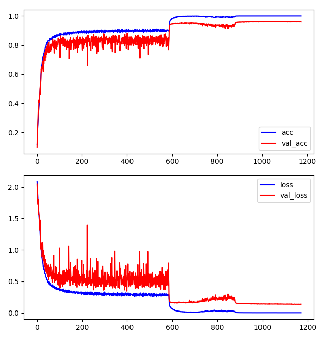

# resneXt_pytorch

> ResNeXt-29, 8x64d on cifar10 	(parameters: 34.4M, accuracy: 96.14%)

### training

* run `python3 train.py` 
* you are suggested to replace the *means & stdevs* of training data with yours (compute them using `mean.py`)
* it takes two days to train on a two titan x
* there are logs I have trained in `bak` folder

### results

* it can get at most 96.14% / mean 95.96% on the validation set (compare to 96.35% in origin paper [origin paper](https://arxiv.org/pdf/1611.05431v2.pdf) with same setup)

* training curve is shown below:

  

### dependency

* python 3.x
* pytorch 0.4.0
* matplotlib (for `plot.py`)